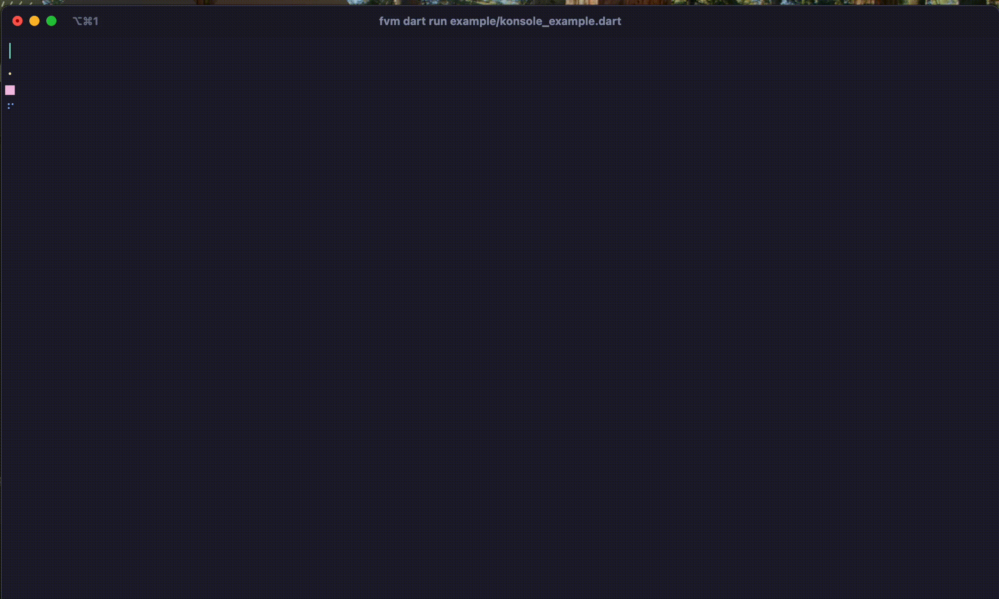
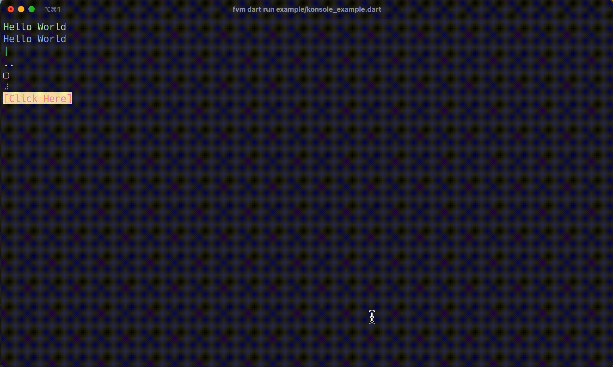
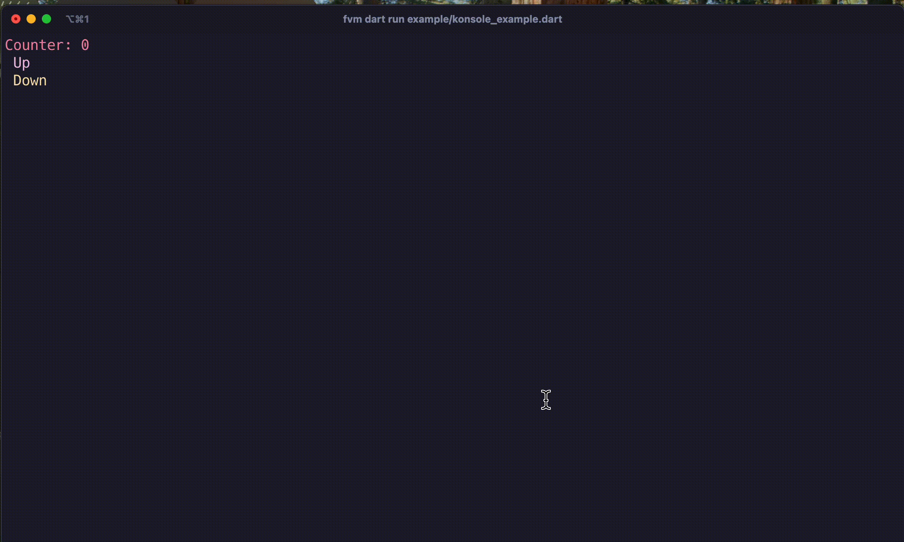

# Konsole - A lightweight TUI framework for Dart 🎯

A modern, feature-rich terminal UI framework for Dart. Build interactive command-line interfaces with ease using a component-based architecture.

Konsole provides a simple yet powerful way to create terminal applications with rich UI components like boxes, buttons, spinners, and more.
## Example

## Example

<div align="center">
  <table>
    <tr>
      <td align="center">
        
        <br />
        <em>Basic Components Demo</em>
      </td>
      <td align="center">
        
        <br />
        <em>Interactive Components</em>
      </td>
    </tr>
    <tr>
      <td align="center" colspan="2">
        
        <br />
        <em>TUI Counter App with Konsole</em>
      </td>
    </tr>
  </table>
</div>
## Features

- 🎨 **Rich component library** - Buttons, boxes, spinners, text labels, and more
- 📊 **Flexible layout system** - Use rows and columns for intuitive layouts
- 🎯 **Focus management** - Tab navigation between interactive elements
- 🌈 **ANSI color support** - Full terminal color customization
- ⌨️ **Input handling** - Process keyboard input from your users
- 🔄 **Update loop** - Automatic rendering with animation support

## Installation

Add Konsole to your `pubspec.yaml`:

```yaml
dependencies:
  konsole: ^1.0.0
```

Then run:

```bash
dart pub get
```

## Core Concepts

Konsole is built around a few simple concepts:

- **Components**: UI elements like Button, Text, Box
- **Layouts**: Row and Column components for organizing elements
- **Application**: The main Konsole class that manages components and rendering
- **Input Handling**: Each component can respond to user input

## Components

### Basic Components

| Component | Description                                     |
| --------- | ----------------------------------------------- |
| `Text`    | Simple text display with color support          |
| `Button`  | Interactive button with callback support        |
| `Box`     | Container with border and optional title        |
| `Spinner` | Animated loading indicator with multiple styles |

More to come.

### Layout Components

| Component | Description                 |
| --------- | --------------------------- |
| `Row`     | Horizontal layout container |
| `Column`  | Vertical layout container   |

## Usage

### Simple Example

```dart
import 'package:konsole/konsole.dart';

void main() {
  final app = Konsole();
  
  app.add(Text("Hello Konsole!", fgColor: KonsoleColors.green));
  
  app.run();
}
```

### Interactive Counter Example

```dart
import 'package:konsole/konsole.dart';

void main() {
  final app = Konsole();

  final counter = Counter(fgColor: KonsoleColors.red);
  
  app.add(Box(
    Column([
      counter,
      Row([
        Button("Increment", onPressed: () => counter.value++),
        Button("Decrement", onPressed: () => counter.value--),
      ]),
    ]),
    title: "Counter Demo",
  ));
  
  app.run();
}
```

### Complex Layout Example

```dart
import 'package:konsole/konsole.dart';

class Counter extends KonsoleComponent {
  int value;
  String fgColor;
  String? bgColor;
  int totalWidth;

  Counter({
    this.value = 0,
    this.fgColor = KonsoleColors.white,
    this.bgColor,
    this.totalWidth = 20,
    super.marginHorizontal,
    super.marginVertical,
  }) : super(width: totalWidth, height: 1) {
    focusable = true;
  }

  @override
  String render() {
    String text = 'Counter: $value';
    text =
        text.length > totalWidth
            ? text.substring(0, totalWidth)
            : text.padRight(totalWidth);
    return Ansi.color(text, fg: fgColor, bgColor: bgColor);
  }

  @override
  void handleInput(String input) {
    if (focused) {
      if (input == '\x1B[A') value++;
      if (input == '\x1B[B') value--;
    }
  }
}


void main() {
  final app = Konsole();

  final counter = Counter(fgColor: KonsoleColors.red, totalWidth: 35);

  final counterBox = Column([
    counter,
    Column([
      Button(
        'Up',
        fgColor: KonsoleColors.magenta,
        onPressed: () => counter.value++,
        customWidth: 10,
      ),
      Button(
        'Down',
        fgColor: KonsoleColors.yellow,
        onPressed: () => counter.value--,
        customWidth: 10,
      ),
    ]),
  ]);

  app.add(
    Row([
      counterBox,
      Column([
        Spinner.line(fgColor: KonsoleColors.cyan),
        Spinner.dot(fgColor: KonsoleColors.yellow),
        Spinner.box(fgColor: KonsoleColors.magenta),
        Spinner(fgColor: KonsoleColors.blue),
      ]),
    ]),
  );

  app.run();
}
```

## Component Details

### Text

Display styled text with color support:

```dart
Text(
  "Hello World",
  fgColor: KonsoleColors.green,
  bgColor: KonsoleColors.bgBlack,
)
```

### Button

Interactive button that can respond to user input:

```dart
Button(
  "Click Me",
  fgColor: KonsoleColors.white,
  bgColor: KonsoleColors.bgBlue,
  onPressed: () => print("Button clicked!"),
)
```

### Box

Container with border and optional title:

```dart
Box(
  Text("Content inside box"),
  title: "Box Title",
  fgColor: KonsoleColors.cyan,
)
```

### Spinner

Animated loading indicators with multiple styles:

```dart
// Default spinner '⠋', '⠙', '⠹', '⠸', '⠼', '⠴', '⠦', '⠧', '⠇', '⠏'
Spinner(fgColor: KonsoleColors.blue)

// Dot-style spinner '.', '..', '...', '....'
Spinner.dot(fgColor: KonsoleColors.yellow)

// Line-style spinner
Spinner.line(fgColor: KonsoleColors.cyan)

// Box-style spinner  '□', '■', '▣', '▢'
Spinner.box(fgColor: KonsoleColors.magenta)
```

### Counter

Interactive numeric counter:

```dart
Counter(
  value: 10,
  fgColor: KonsoleColors.red,
  totalWidth: 20, 
)
```

## Key Navigation

- `Tab`: Move focus between interactive components
- `Enter`: Activate focused buttons
- `Up/Down Arrow`: Interact with counter components
- `q`: Quit the application

## Color Support

Konsole provides built-in ANSI color constants:

```dart
// Foreground colors
KonsoleColors.black
KonsoleColors.red
KonsoleColors.green
KonsoleColors.yellow
KonsoleColors.blue
KonsoleColors.magenta
KonsoleColors.cyan
KonsoleColors.white

// Background colors
KonsoleColors.bgBlack
KonsoleColors.bgRed
KonsoleColors.bgGreen
KonsoleColors.bgYellow
KonsoleColors.bgBlue
KonsoleColors.bgMagenta
KonsoleColors.bgCyan
KonsoleColors.bgWhite
```

## Creating Custom Components

Extend the `KonsoleComponent` class to create your own components:

```dart
class MyCustomComponent extends KonsoleComponent {
  MyCustomComponent({super.marginHorizontal, super.marginVertical}) : super(width: 10, height: 1);

  @override
  String render() {
    return "My custom component";
  }
  
  @override
  void handleInput(String input) {
    // Handle input here
  }
  
  @override
  void update(double dt) {
    // Update state here
  }
}
```

## Layout System

Konsole uses a simple but powerful layout system with two main layout components:

1. **Row**: Horizontal layout that arranges components from left to right
2. **Column**: Vertical layout that arranges components from top to bottom

Both layout components support margins:

```dart
// Horizontal layout with margin
Row([component1, component2], marginHorizontal: 2, marginVertical: 1)

// Vertical layout with margin
Column([component1, component2], marginHorizontal: 2, marginVertical: 1)
```

Each component can also have its own margins:

```dart
Text("Hello", marginHorizontal: 2, marginVertical: 1)
```

## License

This project is licensed under the MIT License - see the LICENSE file for details.

## Contributing

Contributions are welcome! Please feel free to submit a Pull Request.

1. Fork the repository
2. Create your feature branch (`git checkout -b feature/amazing-feature`)
3. Commit your changes (`git commit -m 'Add some amazing feature'`)
4. Push to the branch (`git push origin feature/amazing-feature`)
5. Open a Pull Request
